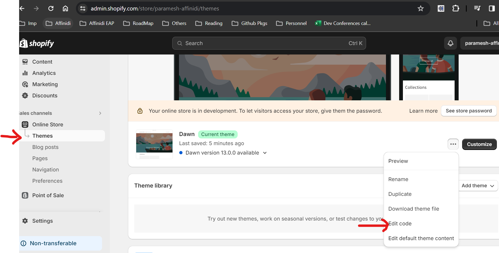
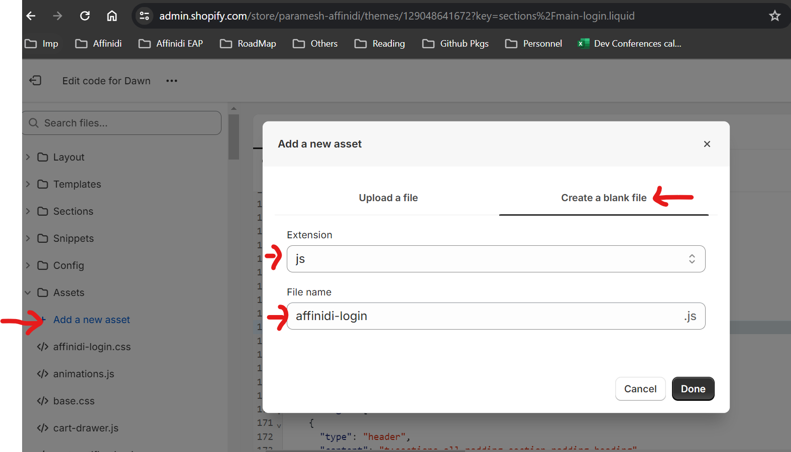
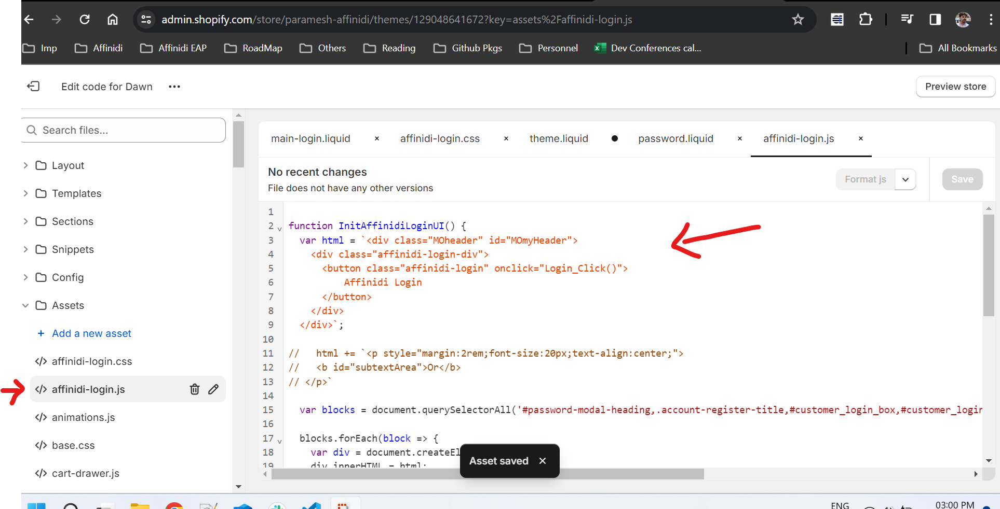
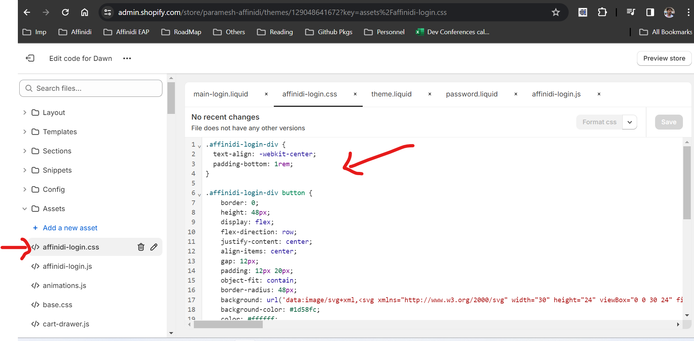
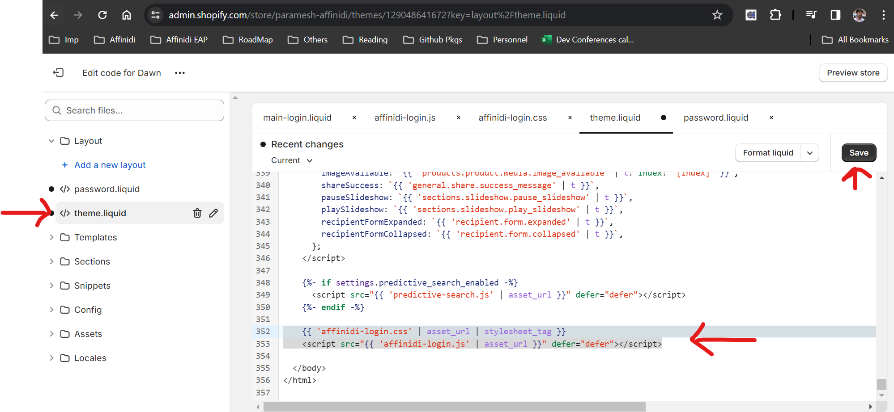
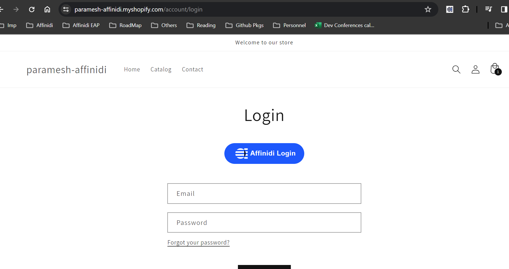
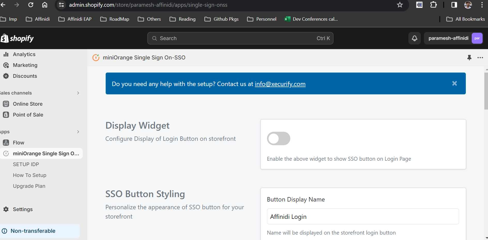
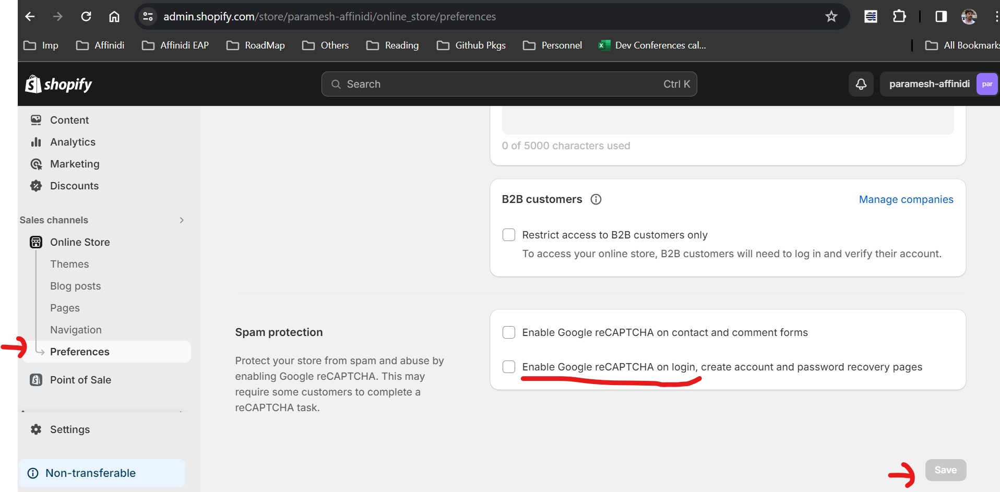

https://gro.club/

# Theme Customization for Adding "Affinidi Login" button

1. Edit the Theme Code by opening the store -> Online Store -> Theme -> Edit Code 

***Note***: Take backup of theme before making any changes to Theme



2. Click on option `Add a new asset` under `Assets` menu

3. Create a new Blank file with `JS` as extension and file name as `affinidi-login` 


4. Copy the code from file [affinidi-login.js](./affinidi-login.js) and paste in the above JS file just created and click on Save button


5. Create a new Blank file with `CSS` as extension and file name as `affinidi-login` 

6. Copy the code from file [affinidi-login.css](./affinidi-login.css) and paste in the CSS file just created and click on Save button


7. Open the file `theme.liquid` file under `Layout` menu 

8. Paste the below code at the end of the file
```
    {{ 'affinidi-login.css' | asset_url | stylesheet_tag }}
    <script src="{{ 'affinidi-login.js' | asset_url }}" defer="defer"></script>
```


9. Preview the store and should the see the Login Button


10. Switch off the `Display Widget` in miniOrange App, as we have added our own SSO button styling


11. Uncheck the Captcha option for Login/Register page, to avoid users to select captcha while Login into store.
